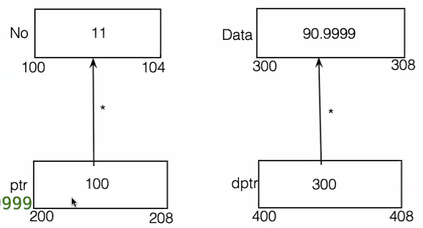

Date : 23/02/2024

# Pointer in C & C++
    - Pointer is variable which stores address.

1) the concept of pointers is applicable in <u>native</u> programming langugages like c and c ++ 
    - native programming language is the langauge which interacts with operating system directly.
    - pointer is considered as derived data type in <u>C & C++</u>. 
    due to security reasons their is no such concept of pointers in java.  
     pointer can store address of any variable which gets it's own memory. 
     in 32 bit architecture address of any variable is considered as unsigned long. 
     the size for unsigned long is 8 bytes

2) According to above concept size of every pointer is always 8 bytes 

consider the below syntax which used to create syntax

- int No = 11;  
 int *ptr = &No;
- according to the above syntax -
    - No is variable of type integer currently intialliased with 11
    - ptr is pointer which holds the address of integer currently it holds the address of No.
    - we can draw the digramatic representation of above syntax as

    
    - to store the address of any variable we use & (address of) operator.
    - at the time of creating the pointer we have to use * operator. in case of pointer * is considered as a <u> de-reference operator</u>.
    - to fetch the data which is pointed by the pointer we have to use * operator(De-reference Operator)
    - consider the below application which demonstrate the use of Pointer
    Pointer1.c
    - we can create pointer which points to any  primitve data types
    
    ex, 
    char ch = 'A'; 
    int i = 11; 
    float f = 89.99f; 
    double d = 90.9999; 

    char *cptr = &ch; 
    int *iptr = &i; 
    float *fptr = &f; 
    double *dptr = &d; 

- we can create a pointer which points to any derived data type like <u> array, pointer, function.</u>

- we can create a pointer which points to another pointer 

- consider the below  which will demonstrate the concept of pointer to pointer

int no = 11;
int *p = &no;
int **q = &p;
int ***x = &q;
int ****y = &x;
int *****z = &y;

no              11
p               100
x               300
y               500
z               400
q               200
&no             100
&p              200
&z              
&x
&y
&q
sizeof(no)      4
sizeof(p)       8
sizeof(q)       8
sizeof(x)       8
sizeof(y)       8
sizeof(z)       8
*p              11
***y            100
****z           100
**q             11 
***x            11
**x             100
*x              200
****y           11
*****z          11

date :- 10/05/2024

# Servlet : -
    Servlet is consider as technology it's use to create web applications.
    the concept of servlet is use to create serverside application using java.
    by using the concept of servlet we can create dynamic web pages 
    the servlet internally uses client server architecture.
    where servlet resides in serverside part of the application.

# Servlet Architecture :-

1.    on client side we have to use web browser which is ude to send the request to the web server.
2.    client send the request which is considered as http request which gets accepted bya server.
3.   after getting the request inside the server the web container executes the java applicationthe result of java application gets forwarded towards the client.
4.    the result gets forwarded as http response.
5.    now the web browser is responsible todisplay the result by using the html language.
6.    if our server needs to send the request to the database then server connects with the databases and get the required data from the database 
7.    inside the servlet application we have to write the logic inside doGet method from that java code we sends the result into html format.

# Command Line Arguments :
1. CLA are considered as arguments which can be passed to the main function.
2. to pass the command line arguments we have to provide it at the time of executing our application 

- consider th below example where we pass multiple command line arguments to the main function which get's accepted into the parameter of main function.

    - // javac command.java
    - //java command 11 Demo Marvellous PPA LB

    

# Command Line Argument in C and C++ :

1. in case of C or C++ the parameter we are passing for the main function is optional 

2. the first argument of command line argument contents the name of executable.
3. other than that everything is exactly same as java 
4. in case of C and C++ the first parameter is argc which contents the no of arguments as command line arguments.